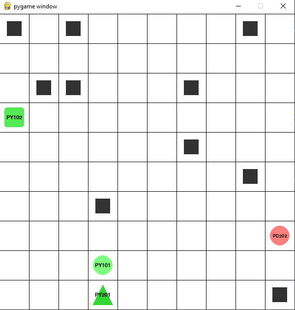

# 🐾 Predator–Prey Gridworld Environment

<p align="center">
  <a href="https://provalarous.github.io/Predator-Prey-Archetype-Gridworld-Environment/">
    
  </a>
  <a href="./CONTRIBUTING.md">
    
  </a>
  <a href="./CODE_OF_CONDUCT.md">
    
  </a>
  <a href="./LICENSE">
    
  </a>
</p>

A **discrete, grid-based multi-agent predator–prey environment** designed as a controlled research testbed for studying coordination, pursuit–evasion, and emergent behavior in Multi-Agent Reinforcement Learning (MARL).


<h3> Early Environment SnapShot</h3>


---

## Documentation 

Full documentation is available at: **[https://provalarous.github.io/Predator-Prey-Archetype-Gridworld-Environment/](https://provalarous.github.io/Predator-Prey-Archetype-Gridworld-Environment/)**

- [Usage Guide](https://provalarous.github.io/Predator-Prey-Archetype-Gridworld-Environment/usage/)
- [Agent Concepts](https://provalarous.github.io/Predator-Prey-Archetype-Gridworld-Environment/agents/)
- [Environment Guide](https://provalarous.github.io/Predator-Prey-Archetype-Gridworld-Environment/environment/)
- [API Reference Agents](https://provalarous.github.io/Predator-Prey-Archetype-Gridworld-Environment/api/agents/)
- [API Reference GridWorldEnv](https://provalarous.github.io/Predator-Prey-Archetype-Gridworld-Environment/api/gridworld/)

---

## Overview

This repository provides a **discrete, grid-based predator-prey simulation environment** designed to support controlled, interpretable, and reproducible experiments in MARL. The environment models classic predator-prey dynamics where multiple agents (predators and prey) interact and learn in a bounded grid world.

Key goals of this framework:

* Facilitate **mechanistic understanding** of MARL behavior
* Support **reproducible research** and **ablation studies**
* Provide an **accessible learning tool** for students and new researchers

---

## Features

### Fully Interpretable

* **State and action spaces are fully enumerable and transparent**, making it easy to track agent behavior, transitions, and environment evolution step-by-step.

### Modular and Customizable

* **Variables and reward structures can be modified in isolation**, enabling controlled experimentation.
* Easily change grid size, agent behavior, episode length, reward schemes, terminal conditions, etc.

### Built for Rigorous Experimentation

* **Reproducible ablation experiments** are supported by design.
* Codebase encourages transparency, logging, and clear interpretation of learning dynamics.

### Education-Ready

* **Simplified structure** and clean API make it beginner-friendly.
* Excellent for undergraduates or early-stage researchers to explore MARL concepts without the overhead of complex simulator frameworks.

---

## Use Cases

* Studying **emergent cooperation and competition**
* Benchmarking MARL algorithms in a clean, discrete setting
* Analyzing **credit assignment**, **multi-agent exploration**, and **policy coordination**
* Teaching reinforcement learning and agent-based modeling

---

## Environment Dynamics

* Agents: Can be initialized as `predator`, `prey`, or any custom role
* Gridworld: 2D discrete space with obstacle-free navigation
* Actions: {UP, DOWN, LEFT, RIGHT, STAY}
* Rewards: Configurable, including custom interaction-based incentives
* Terminal conditions: Catching prey, timeouts, or customizable rules

---

## Getting Started

### Repository Structure 

```text
Predator-Prey-Gridworld-Environment/
├── src/
│   ├── multi_agent_package/       # Core environment code
│   │   ├── agents.py              # Agent class
│   │   ├── gridworld.py           # GridWorldEnv class
│   │   └── __init__.py
│   └── baselines/                 # RL algorithm implementations
│       ├── IQL/                   # Independent Q-Learning
│       ├── CQL/                   # Central Q-Learning
│       └── MIXED/                 # Mixed strategies
├── docs/                          # Documentation (MkDocs)
├── tests/                         # Unit tests
├── requirements.txt               # Runtime dependencies
├── requirements-dev.txt           # Development dependencies
└── mkdocs.yml                     # Documentation config
```

### Installation

Clone the repository:

```bash
git clone https://github.com/ProValarous/Predator-Prey-Gridworld-Environment.git
cd Predator-Prey-Gridworld-Environment
```

Install required dependencies:

```bash
pip install -r requirements.txt
```

### Example Usage

```python
from multi_agent_package.gridworld import GridWorldEnv
from multi_agent_package.agents import Agent

# Define agents (type, team, name)
predator = Agent("predator", "predator_1", "Hunter")
prey = Agent("prey", "prey_1", "Runner")

# Create environment
env = GridWorldEnv(
    agents=[predator, prey],
    size=8,
    render_mode="human"
)

# Run a single episode
obs, info = env.reset(seed=42)
done = False

while not done:
    actions = {
        "Hunter": env.action_space.sample(),
        "Runner": env.action_space.sample()
    }
    result = env.step(actions)
    done = result["done"]

env.close()
```

---


## Contributing

We welcome contributions that improve the clarity, utility, or extensibility of the environment. If you have ideas for enhancements, fixes, or new features, please open an issue or submit a pull request.

---

## Citation

If you use this environment in your research, teaching, or project, please cite it using the following BibTeX:

```bibtex
@misc{predatorpreygridworld,
  author       = {Ahmed Atif},
  title        = {Predator-Prey Gridworld Environment},
  year         = {2025},
  howpublished = {\url{https://github.com/ProValarous/Predator-Prey-Gridworld-Environment}},
  note         = {A discrete testbed for studying Multi-Agent Reinforcement Learning dynamics.}
}
```

---

## License

This project is licensed under the Apache-2.0 license.

---

## Contact

For any questions, issues, or collaborations, please reach out via the [GitHub repository](https://github.com/ProValarous/Predator-Prey-Gridworld-Environment/issues).

---

## Acknowledgements

This project draws inspiration from classic RL environments and aims to provide a more transparent, MARL-specific framework. Contributions from the community are deeply appreciated!
